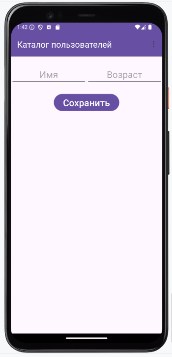
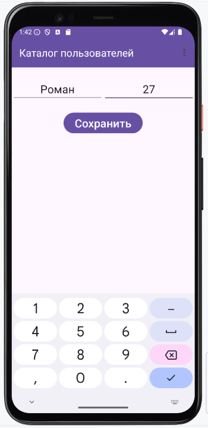
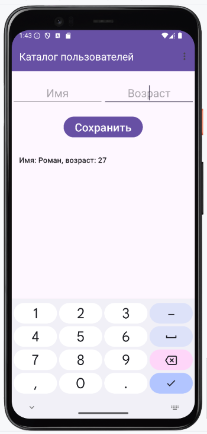
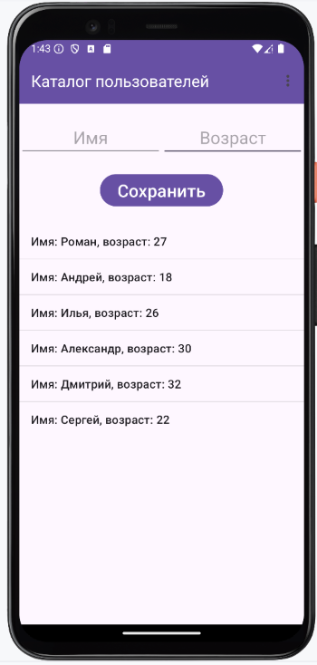
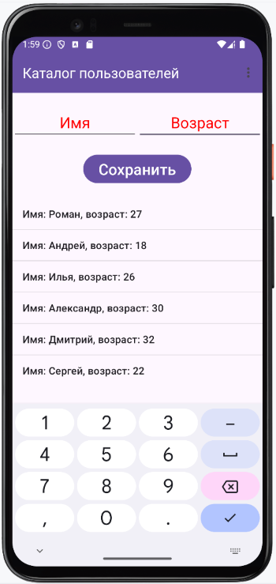
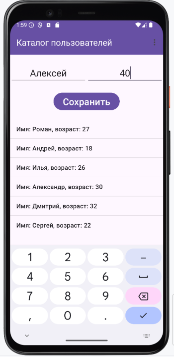
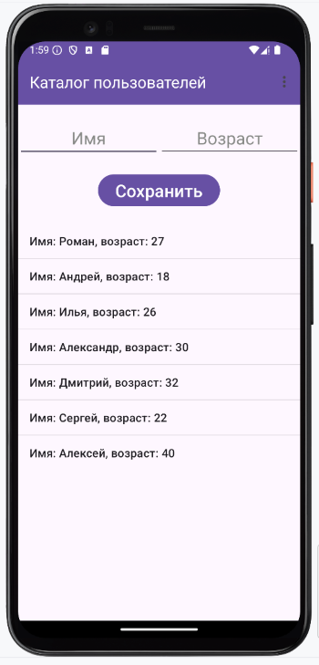
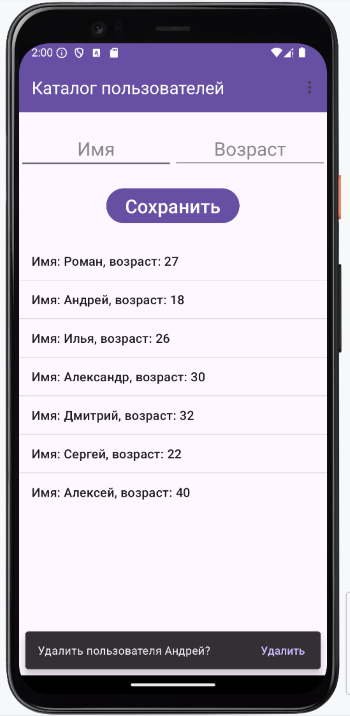
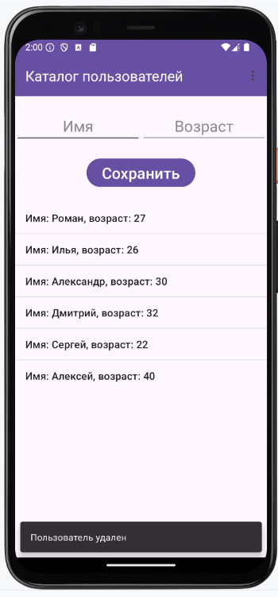
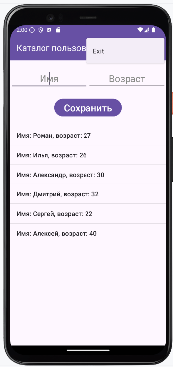

# Домашнее задание по теме "ListView"

### Программа «Каталог пользователей»
Написать программу, содержащую список пользователей.
1. На главном экране необходимо создать **Toolbar** с заголовком **«Каталог пользователей»**.
2. Создать два поля ввода: имени и возраста.
3. Создать кнопку **«Сохранить»**.
4. Создать **ListView**, в который будут помещены созданные пользователи.
5. Создать меню с одним пунктом **«Exit»**.

Описание работы программы:

После запуска приложения поля ввода заполняем данными: Имя и возраст. По нажатию кнопки **«Сохранить»** в **ListView** появляются созданные пользователи. Поля ввода при добавлении очищаются.
 Пользователей можно удалять по нажатию на элемент списка с пользователем, которого нужно удалить.
 При выборе пункта меню **«Exit»** приложение закрывается.
Для удобства работы необходимо создать класс **User** с конструктором, в котором содержатся свойства имени и возраста. Обратите внимание на то, что список, в котором будут хранится пользователи будет типа **User**.

Приложение необходимо сохранить проектом в удаленном репозитории, для проверки качества предоставить ссылку преподавателю, либо сделать скрины эмулятора при каждом шаге работы приложения.

### Скриншоты домашнего задания

Скриншоты здесь

