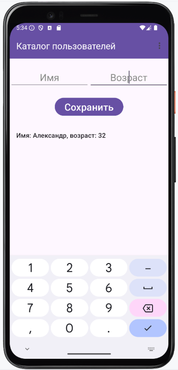

# Домашнее задание по теме "ListView"

### Программа «Каталог пользователей»
Написать программу, содержащую список пользователей.
1. На главном экране необходимо создать **Toolbar** с заголовком **«Каталог пользователей»**.
2. Создать два поля ввода: имени и возраста.
3. Создать кнопку **«Сохранить»**.
4. Создать **ListView**, в который будут помещены созданные пользователи.
5. Создать меню с одним пунктом **«Exit»**.

Описание работы программы:

После запуска приложения поля ввода заполняем данными: Имя и возраст. По нажатию кнопки **«Сохранить»** в **ListView** появляются созданные пользователи. Поля ввода при добавлении очищаются.
 Пользователей можно удалять по нажатию на элемент списка с пользователем, которого нужно удалить.
 При выборе пункта меню **«Exit»** приложение закрывается.
Для удобства работы необходимо создать класс **User** с конструктором, в котором содержатся свойства имени и возраста. Обратите внимание на то, что список, в котором будут хранится пользователи будет типа **User**.

Приложение необходимо сохранить проектом в удаленном репозитории, для проверки качества предоставить ссылку преподавателю, либо сделать скрины эмулятора при каждом шаге работы приложения.

### Скриншоты домашнего задания по теме "ListView"

Скриншоты здесь

# Домашнее задание по теме "AlertDialog"

### Приложение «Список пользователей» (доработанный)

На основе приложения о добавлении пользователей в список (предыдущее домашнее задание), доработать приложение по удалению пользователей путем вызова диалогового окна при нажатии на элемент списка.
В дополнении к логике приложения необходимо создать:
1.    Класс `MyDialog`, в котором создается диалоговое окно.
      В нем предложить пользователю подтверждение действия по удалению. В диалоговом окне содержатся две кнопки **«Да»** - подтверждение удаления **«Нет»** - отмена действия и закрытие диалогового окна.
2.    Закрытие приложения выполнить через создание меню и одного пункта **«Exit»**. По нажатию на него, происходит завершение работы приложения.

Приложение необходимо сохранить проектом в удаленном репозитории, для проверки качества предоставить ссылку преподавателю, либо сделать скрины эмулятора при каждом шаге работы приложения.

### Скриншоты домашнего задания по теме "AlertDialog"

Скриншоты здесь

